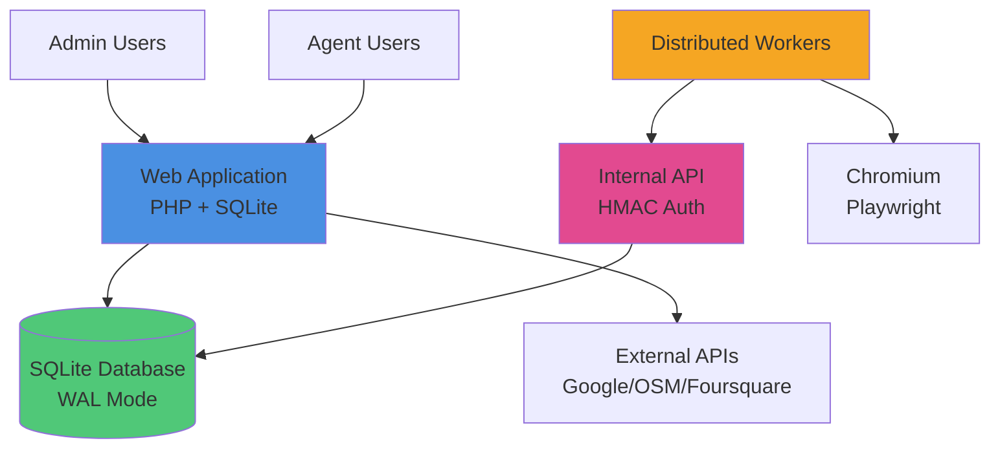
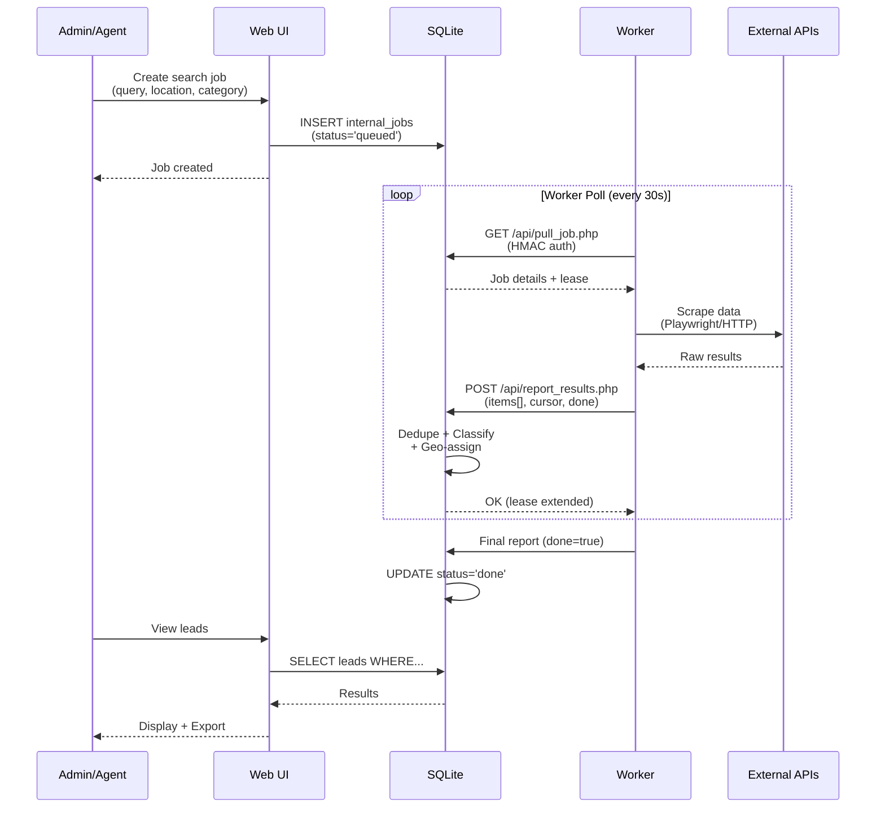
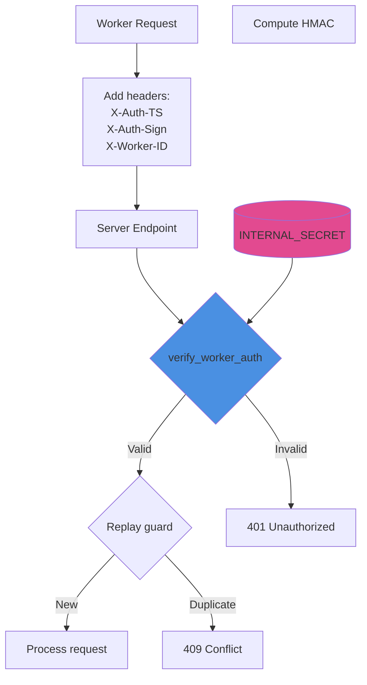
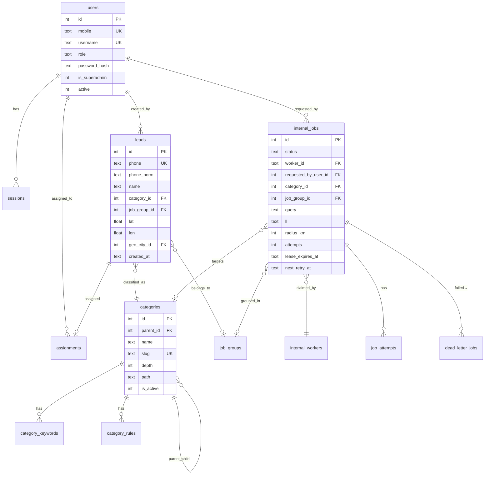
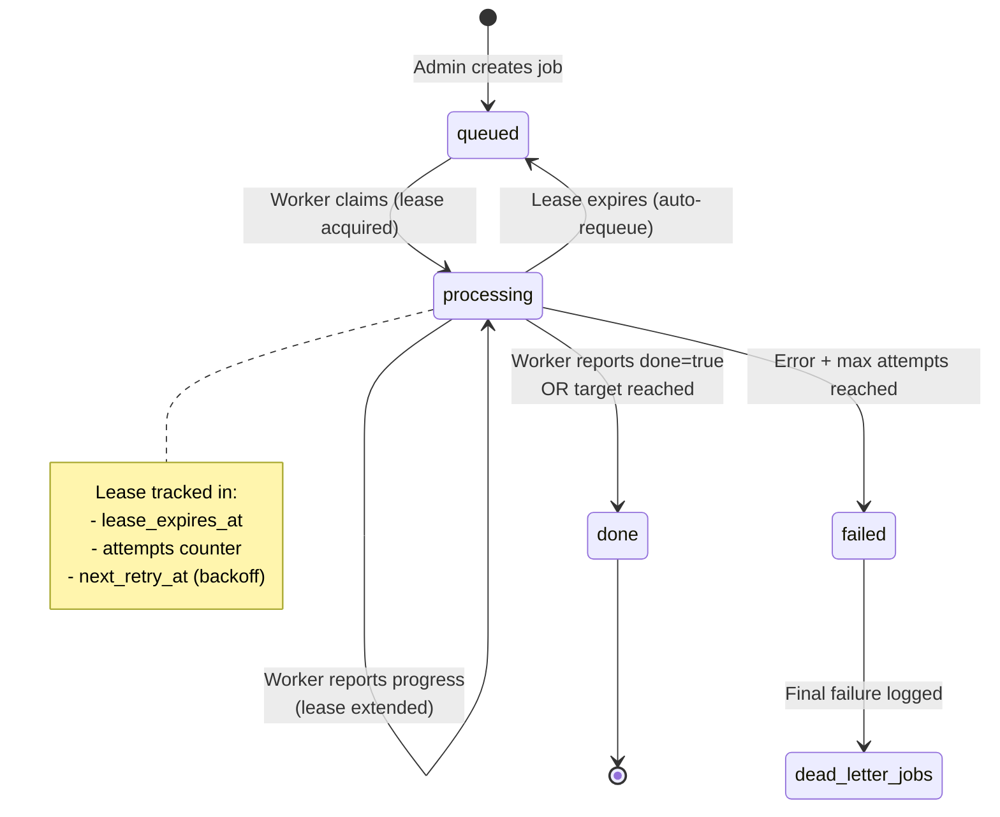
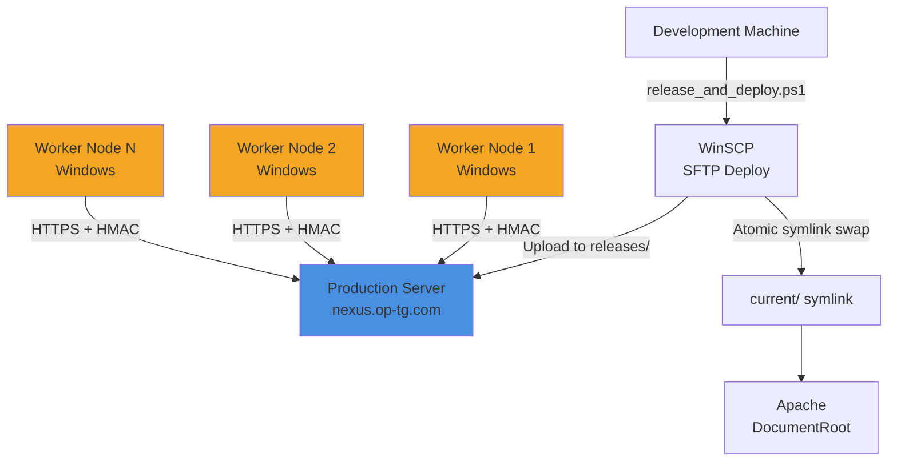

# ARCHITECTURE — System Design & Data Flow

> **Evidence-Based**: All architecture insights derived from actual code analysis ([lib/](file:///d:/projects/forge.op-tg.com/forge.op-tg.com/lib/), [api/](file:///d:/projects/forge.op-tg.com/forge.op-tg.com/api/), [config/db.php](file:///d:/projects/forge.op-tg.com/forge.op-tg.com/config/db.php))

---

## 1. SYSTEM OVERVIEW (C4 Level 1)



**Components**:
- **Web Application**: Server-rendered PHP pages, session-based auth, CSRF protection
- **Internal API**: HMAC-authenticated endpoints for worker communication
- **Distributed Workers**: Node.js + Playwright agents scraping external data sources
- **SQLite Database**: Single-file ACID storage with Write-Ahead Logging
- **External Providers**: Google Places, OSM, Foursquare, Mapbox, Radar.io

**Evidence**: 
- Server files: [admin/\*.php](file:///d:/projects/forge.op-tg.com/forge.op-tg.com/admin/), [agent/\*.php](file:///d:/projects/forge.op-tg.com/forge.op-tg.com/agent/)
- API files: [api/pull_job.php](file:///d:/projects/forge.op-tg.com/forge.op-tg.com/api/pull_job.php), [api/report_results.php](file:///d:/projects/forge.op-tg.com/forge.op-tg.com/api/report_results.php)
- Worker: [worker/index.js](file:///d:/projects/forge.op-tg.com/forge.op-tg.com/worker/index.js)
- DB: [config/db.php](file:///d:/projects/forge.op-tg.com/forge.op-tg.com/config/db.php)

---

## 2. WORKFLOW: LEAD EXTRACTION (End-to-End)



**Evidence**: 
- Job creation: [api/jobs_multi_create.php](file:///d:/projects/forge.op-tg.com/forge.op-tg.com/api/jobs_multi_create.php)
- Worker pull: [api/pull_job.php#L126-L137](file:///d:/projects/forge.op-tg.com/forge.op-tg.com/api/pull_job.php#L126-L137)
- Results ingestion: [api/report_results.php#L112-L216](file:///d:/projects/forge.op-tg.com/forge.op-tg.com/api/report_results.php#L112-L216)
- Classification: [lib/classify.php](file:///d:/projects/forge.op-tg.com/forge.op-tg.com/lib/classify.php), invoked at [report_results.php#L141](file:///d:/projects/forge.op-tg.com/forge.op-tg.com/api/report_results.php#L141)

---

## 3. AUTHENTICATION & AUTHORIZATION ARCHITECTURE

### 3.1 Admin/Agent Authentication

```mermaid
graph LR
    Login[Login Page]
    Auth[lib/auth.php]
    Session[(sessions table)]
    Cookie[Remember Cookie]
    
    Login -->|POST mobile+password| Auth
    Auth -->|password_verify| Valid{Valid?}
    Valid -->|Yes| SetSession[Set $_SESSION['uid']]
    Valid -->|Yes, remember=true| SetCookie[Issue token cookie]
    SetCookie --> Session
    Valid -->|No| Fail[401]
    
    Protected[Protected Page] -->|require_login| CheckAuth{Authenticated?}
    CheckAuth -->|Session exists| UserData
    CheckAuth -->|Cookie exists| ValidateCookie{Token valid?}
    ValidateCookie -->|Yes| UserData[Load user data]
    ValidateCookie -->|No| Redirect[→ login page]
    CheckAuth -->|No auth| Redirect
    
    style Auth fill:#4A90E2
    style Session fill:#50C878
```

**Flow**:
1. User submits `mobile` + `password`
2. [`lib/auth.php::login()`](file:///d:/projects/forge.op-tg.com/forge.op-tg.com/lib/auth.php#L19) verifies with `password_verify()`
3. On success: `$_SESSION['uid']` set + optional long-lived cookie
4. All protected pages call [`require_login()`](file:///d:/projects/forge.op-tg.com/forge.op-tg.com/lib/auth.php#L21-L35)
5. Role enforcement via [`require_role()`](file:///d:/projects/forge.op-tg.com/forge.op-tg.com/lib/auth.php#L37-L47)

**Security Features**:
- ✅ Password hashing (bcrypt/argon2 via `password_hash`)
- ✅ Session regeneration on login ([auth.php#L19](file:///d:/projects/forge.op-tg.com/forge.op-tg.com/lib/auth.php#L19))
- ✅ HttpOnly + Secure + SameSite cookies ([auth.php#L6-L13](file:///d:/projects/forge.op-tg.com/forge.op-tg.com/lib/auth.php#L6-L13))
- ✅ Token-based remember-me with SHA-256 hashing

### 3.2 Worker Authentication (HMAC)



**Signature Algorithm** (from [docs/API.md#L47-L49](file:///d:/projects/forge.op-tg.com/forge.op-tg.com/docs/API.md#L47-L49)):
```
signature = HMAC-SHA256(
    key: INTERNAL_SECRET,
    message: upper(METHOD) + '|' + PATH + '|' + sha256(body) + '|' + TIMESTAMP
)
```

**Implementation**: [lib/security.php](file:///d:/projects/forge.op-tg.com/forge.op-tg.com/lib/security.php)

**Replay Prevention**:
- Table: `hmac_replay(worker_id, ts, body_sha, method, path)` — unique composite
- Checked at: [api/pull_job.php#L37-L46](file:///d:/projects/forge.op-tg.com/forge.op-tg.com/api/pull_job.php#L37-L46), [api/report_results.php#L19-L31](file:///d:/projects/forge.op-tg.com/forge.op-tg.com/api/report_results.php#L19-L31)
- Cleanup: Periodic TTL pruning (default 7 days)

---

## 4. DATA MODEL (Entity Relationship)



**Evidence**: All schema extracted from [config/db.php#L6-L464](file:///d:/projects/forge.op-tg.com/forge.op-tg.com/config/db.php#L6-L464)

---

## 5. BACKEND MODULE BREAKDOWN

### 5.1 Core Libraries (`lib/`)

| Module | Purpose | Key Functions | Evidence |
|--------|---------|---------------|----------|
| **auth.php** | Authentication & sessions | `login()`, `logout()`, `require_login()`, `require_role()` | [lib/auth.php](file:///d:/projects/forge.op-tg.com/forge.op-tg.com/lib/auth.php) |
| **system.php** | Security headers, CSRF, rate limiting, CSP | `emit_security_headers()`, `system_auto_guard_request()` | [lib/system.php#L18-L216](file:///d:/projects/forge.op-tg.com/forge.op-tg.com/lib/system.php#L18-L216) |
| **security.php** | HMAC auth, replay guard | `verify_worker_auth()`, `hmac_replay_check_ok()` | [lib/security.php](file:///d:/projects/forge.op-tg.com/forge.op-tg.com/lib/security.php) |
| **classify.php** | Business category classification | `classify_lead()`, matching rules engine | [lib/classify.php](file:///d:/projects/forge.op-tg.com/forge.op-tg.com/lib/classify.php) |
| **geo.php** | Geographic classification (SA) | `geo_classify_point()`, `geo_classify_text()` | [lib/geo.php](file:///d:/projects/forge.op-tg.com/forge.op-tg.com/lib/geo.php) |
| **providers.php** | External API wrappers | `provider_osm()`, `provider_google_details()`, `orchestrate_fetch()` | [lib/providers.php](file:///d:/projects/forge.op-tg.com/forge.op-tg.com/lib/providers.php) |
| **csrf.php** | CSRF token generation/validation | `csrf_token()`, `csrf_verify()` | [lib/csrf.php](file:///d:/projects/forge.op-tg.com/forge.op-tg.com/lib/csrf.php) |
| **limits.php** | Rate limiting helpers | `cap_remaining_google_details()`, `counter_inc()` | [lib/limits.php](file:///d:/projects/forge.op-tg.com/forge.op-tg.com/lib/limits.php) |
| **categories.php** | Category hierarchy utils | Tree building, path generation | [lib/categories.php](file:///d:/projects/forge.op-tg.com/forge.op-tg.com/lib/categories.php) |

### 5.2 API Endpoints (`api/`)

#### Worker-Facing (HMAC Auth)

| Endpoint | Method | Purpose | Evidence |
|----------|--------|---------|----------|
| **/api/pull_job.php** | GET | Worker claims next queued job | [api/pull_job.php](file:///d:/projects/forge.op-tg.com/forge.op-tg.com/api/pull_job.php) |
| **/api/report_results.php** | POST | Worker submits scraped data | [api/report_results.php](file:///d:/projects/forge.op-tg.com/forge.op-tg.com/api/report_results.php) |
| **/api/heartbeat.php** | GET | Worker presence update | [api/heartbeat.php](file:///d:/projects/forge.op-tg.com/forge.op-tg.com/api/heartbeat.php) |
| **/api/worker_config.php** | GET | Dynamic worker configuration | [api/worker_config.php](file:///d:/projects/forge.op-tg.com/forge.op-tg.com/api/worker_config.php) |
| **/api/latest.php** | GET | Worker update metadata (ETag support) | [api/latest.php](file:///d:/projects/forge.op-tg.com/forge.op-tg.com/api/latest.php) |
| **/api/download_worker.php** | GET | Download worker executable (ZIP/EXE) | [api/download_worker.php](file:///d:/projects/forge.op-tg.com/forge.op-tg.com/api/download_worker.php) |

#### Admin-Facing (Session Auth + CSRF)

| Endpoint | Method | Purpose | Evidence |
|----------|--------|---------|----------|
| **/api/jobs_multi_create.php** | POST | Create multi-location job group | [api/jobs_multi_create.php](file:///d:/projects/forge.op-tg.com/forge.op-tg.com/api/jobs_multi_create.php) |
| **/api/category_search.php** | GET | Search categories (autocomplete) | [api/category_search.php](file:///d:/projects/forge.op-tg.com/forge.op-tg.com/api/category_search.php) |
| **/api/geo_point_city.php** | POST | Resolve city ↔ coordinates | [api/geo_point_city.php](file:///d:/projects/forge.op-tg.com/forge.op-tg.com/api/geo_point_city.php) |
| **/api/export_leads.php** | GET | Export leads CSV | [api/export_leads.php](file:///d:/projects/forge.op-tg.com/forge.op-tg.com/api/export_leads.php) |
| **/api/reclassify.php** | POST | Bulk re-classify existing leads | [api/reclassify.php](file:///d:/projects/forge.op-tg.com/forge.op-tg.com/api/reclassify.php) |

### 5.3 Admin Pages (`admin/`)

**Evidence**: 41 PHP files in [admin/](file:///d:/projects/forge.op-tg.com/forge.op-tg.com/admin/)

Key pages:
- `dashboard.php` — Overview metrics
- `leads.php` — Lead vault with filters
- `workers.php` — Worker registry + circuit breaker
- `health.php` — Job queue health, requeue tools
- `monitor.php` — Real-time worker stream
- `diagnostics/index.php` — System diagnostics + batch exports
- `categories.php` — Category taxonomy management
- `settings.php` — System configuration

---

## 6. JOB LIFECYCLE STATE MACHINE



**States** (from `internal_jobs.status`):
- **queued**: Waiting for worker
- **processing**: Actively being worked (lease active)
- **done**: Completed successfully
- **failed**: Exhausted retries

**Lease Recovery** ([api/pull_job.php#L79-L115](file:///d:/projects/forge.op-tg.com/forge.op-tg.com/api/pull_job.php#L79-L115)):
- On every `pull_job` call, server proactively requeues expired leases
- Jobs stuck in `processing` with expired lease → reset to `queued`
- Attempt logged in `job_attempts` table with reason (e.g., `requeue_expired_offline`)

---

## 7. CLASSIFICATION ENGINE

### 7.1 Category Classification

**Algorithm** ([lib/classify.php](file:///d:/projects/forge.op-tg.com/forge.op-tg.com/lib/classify.php)):
1. Load all active `category_rules` for all categories
2. For each rule, match against lead fields (name, types, website, email, etc.)
3. Match modes: `contains`, `exact`, `regex`
4. Accumulate weighted score per category
5. Return category with highest score if above threshold (default: 1.0)

**Weight Configuration** (from settings):
```
classify_w_kw_name     = 2.0   (keyword match in name)
classify_w_kw_types    = 1.5   (keyword match in Google types)
classify_w_name        = 1.0   (rule match in name)
classify_w_types       = 1.0   (rule match in types)
classify_w_website     = 1.0
classify_w_email       = 1.0
classify_w_city        = 1.0
classify_w_phone       = 1.0
```

**Evidence**: [config/db.php#L324-L333](file:///d:/projects/forge.op-tg.com/forge.op-tg.com/config/db.php#L324-L333)

### 7.2 Geographic Classification

**Supported**: Saudi Arabia (regions, cities, districts)

**Methods**:
1. **Point-based** ([lib/geo.php::geo_classify_point](file:///d:/projects/forge.op-tg.com/forge.op-tg.com/lib/geo.php)):
   - Haversine distance calculation
   - Hierarchical lookup (district → city → region)
   - Returns confidence score

2. **Text-based** ([lib/geo.php::geo_classify_text](file:///d:/projects/forge.op-tg.com/forge.op-tg.com/lib/geo.php)):
   - Fuzzy name matching (Levenshtein)
   - Fallback to parent levels

**Performance Target**: p50 ≤ 50ms, ≥98% accuracy  
**Evidence**: [docs/RUNBOOK.md#L238-L247](file:///d:/projects/forge.op-tg.com/forge.op-tg.com/docs/RUNBOOK.md#L238-L247)

---

## 8. DEDUPLICATION STRATEGY

### 8.1 Phone-Based Deduplication

**Primary Key**: `leads.phone` (UNIQUE constraint)  
**Normalization**: Strip non-digits, apply E.164-like format for Saudi numbers

**Logic** ([api/report_results.php#L118-L124](file:///d:/projects/forge.op-tg.com/forge.op-tg.com/api/report_results.php#L118-L124)):
```php
$digits = preg_replace('/\D+/', '', $rawPhone);
if ($digits[0] === '0') { $digits = ltrim($digits, '0'); }
if (strlen($digits) === 9 || strlen($digits) === 10) {
    if (country === 'sa' && !startsWith('966')) {
        $digits = '966' . $digits;
    }
}
```

### 8.2 Fingerprint-Based Soft Deduplication

**Table**: `leads_fingerprints(lead_id, fingerprint UNIQUE)`  
**Formula**:
```
fingerprint = sha1(phone_norm | provider | city | round(lat,3) | round(lon,3) | day)
```

**Purpose**: Detect same entity from different providers within same day  
**Evidence**: [api/report_results.php#L135-L139](file:///d:/projects/forge.op-tg.com/forge.op-tg.com/api/report_results.php#L135-L139)

---

## 9. EXTERNAL PROVIDER ORCHESTRATION

**Orchestrator**: [`lib/providers.php::orchestrate_fetch()`](file:///d:/projects/forge.op-tg.com/forge.op-tg.com/lib/providers.php#L170-L340)

**Flow**:
1. Parse query + location + radius
2. Check tile TTL (`search_tiles` table) — skip if recent
3. Build scan grid (if exhaustive mode enabled)
4. Iterate providers in configured order (e.g., `osm,foursquare,mapbox,radar,google`)
5. For each provider:
   - Call provider-specific API wrapper
   - Dedupe via `place_cache` table
   - Insert/update leads with geo classification
6. Update tile timestamp

**Exhaustive Mode** ([lib/providers.php#L206-L223](file:///d:/projects/forge.op-tg.com/forge.op-tg.com/lib/providers.php#L206-L223)):
- Grid-based scanning with configurable step size (default: 2km)
- Max points limit (default: 400)
- Full pagination until API exhausted

**Google Places Optimization**:
- Preview IDs first (cheap)
- Fetch details on-demand (expensive, counted against daily cap)
- Cache results in `place_cache` table

---

## 10. RATE LIMITING ARCHITECTURE

### 10.1 Global Rate Limit

**Table**: `rate_limit(ip, key, window_start, count)` — composite PK  
**Implementation**: [lib/system.php#L179-L216](file:///d:/projects/forge.op-tg.com/forge.op-tg.com/lib/system.php#L179-L216)

**Algorithm**:
- Sliding window (60s)
- Per-IP, per-endpoint granularity
- Key = `sha1(IP | SCRIPT_NAME)`
- Auto-pruning old windows

### 10.2 API-Specific Limits

**Google Details Cap**:
- Setting: `daily_details_cap` (default: 1,000,000)
- Tracked in: `usage_counters(day, kind='google_details', count)`
- Checked before each detail fetch ([lib/providers.php#L293](file:///d:/projects/forge.op-tg.com/forge.op-tg.com/lib/providers.php#L293))

---

## 11. WORKER ARCHITECTURE

### 11.1 Worker Components

**Runtime**: Node.js v18 + Playwright Chromium  
**Main Script**: [worker/index.js](file:///d:/projects/forge.op-tg.com/forge.op-tg.com/worker/index.js) (90KB)

**Key Features**:
- Headless browser automation (Playwright)
- Retry logic with exponential backoff
- Progress reporting (batch + cursor)
- Idempotency via `attempt_id` + `idempotency_key`
- Self-update mechanism

**Deployment Options**:
1. **Portable EXE**: `worker.exe` (38MB, includes Node.js runtime)
2. **Source**: `node worker/launcher.js`
3. **Windows Service**: Via `install_service.ps1`

### 11.2 Worker Configuration

**Static** (`worker/.env`):
```
BASE_URL=https://nexus.op-tg.com
INTERNAL_SECRET=<match server>
WORKER_ID=worker-001
```

**Dynamic** (fetched from `/api/worker_config.php`):
```json
{
  "pull_interval_sec": 30,
  "headless": true,
  "until_end": true,
  "max_pages": 5,
  "lease_sec": 180,
  "report_batch_size": 10,
  "report_every_ms": 15000,
  "item_delay_ms": 800
}
```

**Per-Worker Overrides**: Admin can set via `worker_config_overrides_json` setting

---

## 12. CIRCUIT BREAKER PATTERN

**Purpose**: Temporarily disable misbehaving workers

**Mechanism**:
- Admin adds `worker_id` to `cb_open_workers_json` setting (JSON array)
- `/api/pull_job.php` checks list and returns `429 cb_open` for blocked workers
- Worker should back off and retry after `retry_after_sec` (default: 120s)

**Control**: [admin/workers_cb_toggle.php](file:///d:/projects/forge.op-tg.com/forge.op-tg.com/admin/workers_cb_toggle.php)  
**Evidence**: [api/pull_job.php#L48-L55](file:///d:/projects/forge.op-tg.com/forge.op-tg.com/api/pull_job.php#L48-L55)

---

## 13. MONITORING & OBSERVABILITY

### 13.1 Worker Health

**Presence Tracking**:
- Workers call `/api/heartbeat.php` every 30s (default)
- Updates `internal_workers.last_seen`
- "Online" threshold: `workers_online_window_sec` (default: 90s)

**Active Job Tracking**:
- `internal_workers.active_job_id` updated on pull
- Cleared on job completion/failure

**Health Check**:
- Worker exposes `http://localhost:4499/status`
- Returns: version, active job, last heartbeat

### 13.2 Alerting

**Trigger Script**: `tools/ops/alerts_tick.php` (run via cron/scheduled task)

**Conditions**:
- Workers offline > threshold
- Dead letter queue not empty
- Jobs stuck in processing with expired lease

**Channels** (configurable):
- Webhook (JSON or Slack/Discord/Teams format auto-detected)
- Email (SMTP)
- Slack App API (chat.postMessage)

**Evidence**: [docs/RUNBOOK.md#L225-L230](file:///d:/projects/forge.op-tg.com/forge.op-tg.com/docs/RUNBOOK.md#L225-L230)

### 13.3 Audit Logs

**Table**: `audit_logs(user_id, action, target, payload, created_at)`  
**Captured Events**: Admin actions on critical resources (users, workers, settings)

---

## 14. CACHING LAYERS

| Cache Type | Storage | Purpose | TTL | Evidence |
|------------|---------|---------|-----|----------|
| **Place Cache** | `place_cache` table | Provider results (phone, name, city) | N/A (updated on fetch) | [lib/providers.php#L8-L9](file:///d:/projects/forge.op-tg.com/forge.op-tg.com/lib/providers.php#L8-L9) |
| **Tile TTL** | `search_tiles` table | Prevent re-scraping same query+location | 14 days (configurable) | [lib/providers.php#L12](file:///d:/projects/forge.op-tg.com/forge.op-tg.com/lib/providers.php#L12) |
| **OPcache** | PHP opcode cache | Compiled script cache | N/A (managed by PHP) | [api/opcache_reset.php](file:///d:/projects/forge.op-tg.com/forge.op-tg.com/api/opcache_reset.php) |

---

## 15. SECURITY ARCHITECTURE SUMMARY

**Defense Layers**:
1. **Network**: HTTPS enforcement via `.htaccess` + `force_https` setting
2. **Application**:
   - Session-based auth with secure cookies
   - CSRF tokens on all state-changing requests
   - Rate limiting per-IP per-endpoint
   - Content Security Policy (CSP) with nonce support
3. **API**:
   - HMAC-SHA256 signatures for worker auth
   - Replay attack prevention (dedupe table)
   - Circuit breaker for rogue workers
4. **Database**:
   - Parameterized queries (PDO prepared statements)
   - Foreign key constraints enforced
   - Unique constraints for deduplication
5. **Secrets**:
   - Not committed to repo (placeholders only)
   - Rotation support for `internal_secret`

**Security Headers** ([lib/system.php#L18-L71](file:///d:/projects/forge.op-tg.com/forge.op-tg.com/lib/system.php#L18-L71)):
```
X-Content-Type-Options: nosniff
X-Frame-Options: SAMEORIGIN
Referrer-Policy: strict-origin-when-cross-origin
Strict-Transport-Security: max-age=31536000; includeSubDomains
Content-Security-Policy: <nonce-based policy>
```

---

## 16. SCALABILITY CONSIDERATIONS

### Current Architecture (Single-Node SQLite)

**Strengths**:
- ✅ WAL mode allows concurrent reads
- ✅ Horizontal worker scaling (distributed processing)
- ✅ Low latency for small/medium datasets (< 1M rows)
- ✅ Zero-config deployment (no separate DB server)

**Limitations**:
- ⚠️ Single write bottleneck (SQLite lock)
- ⚠️ No multi-server replication (single file)
- ⚠️ File size growth (vacuum needed)

### Migration Path (If Needed)

**Indicators for Migration**:
- Leads table > 10M rows
- Concurrent write contention
- Multi-region deployment

**Target**: PostgreSQL/MySQL (PDO abstraction already in place)  
**Migration Strategy**: Schema export → bulk load → minimal code changes (PDO-based)

---

## 17. DEPLOYMENT ARCHITECTURE



**Deployment Strategy**: Zero-downtime via symlink swap  
**Rollback**: Revert symlink to previous `releases/<timestamp>` directory  
**Evidence**: [docs/RUNBOOK.md#L9-L139](file:///d:/projects/forge.op-tg.com/forge.op-tg.com/docs/RUNBOOK.md#L9-L139)

---

## 18. TECHNOLOGY STACK SUMMARY

| Layer | Technology | Version | Evidence |
|-------|-----------|---------|----------|
| **Backend Runtime** | PHP | Unspecified (recommend 7.4+) | [*.php files](file:///d:/projects/forge.op-tg.com/forge.op-tg.com/) |
| **Database** | SQLite3 | N/A (via PDO) | [config/db.php](file:///d:/projects/forge.op-tg.com/forge.op-tg.com/config/db.php) |
| **Web Server** | Apache | N/A | [.htaccess](file:///d:/projects/forge.op-tg.com/forge.op-tg.com/.htaccess) |
| **Worker Runtime** | Node.js | v18 | [worker/package.json](file:///d:/projects/forge.op-tg.com/forge.op-tg.com/worker/package.json) |
| **Browser Automation** | Playwright | 1.47.0 | [worker/package.json#L9](file:///d:/projects/forge.op-tg.com/forge.op-tg.com/worker/package.json#L9) |
| **HTTP Client** | cURL (PHP), node-fetch | Built-in, 3.3.2 | [bootstrap.php#L17](file:///d:/projects/forge.op-tg.com/forge.op-tg.com/bootstrap.php#L17), [worker/package.json#L8](file:///d:/projects/forge.op-tg.com/forge.op-tg.com/worker/package.json#L8) |

---

## CONCLUSION

OptForge implements a **robust distributed scraping architecture** with:
- ✅ HMAC-authenticated worker orchestration
- ✅ Idempotent job processing with lease-based recovery
- ✅ Multi-provider external API integration
- ✅ Automated classification (business type + geography)
- ✅ Phone-based deduplication with fingerprint fallback
- ✅ Circuit breaker + health monitoring + alerting
- ✅ Zero-downtime deployment via symlink swaps

**Design Patterns**:
- **Job Queue with Leases** (inspired by Cloud Tasks/SQS visibility timeout)
- **HMAC Authentication** (API key signing pattern)
- **Circuit Breaker** (fail-fast for misbehaving workers)
- **Idempotency Keys** (prevent double processing)
- **Replay Prevention** (request deduplication)
- **Backoff & Retry** (exponential backoff with jitter)

**Next Steps** (from Architecture perspective):
1. Document frontend architecture (server-rendered PHP pages analysis)
2. Create detailed module catalog with inter dependencies
3. Identify technical debt and refactoring opportunities
