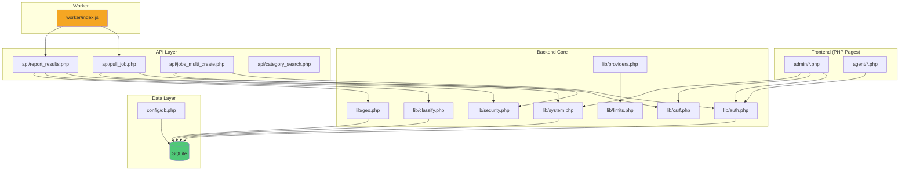

# MODULES CATALOG — Functional Component Registry

> **Evidence-Based**: All modules verified from actual codebase inspection

---

## NAVIGATION

- [1. Backend Core Libraries](#1-backend-core-libraries-lib)
- [2. API Endpoints](#2-api-endpoints-api)
- [3. Admin Interface](#3-admin-interface-admin)
- [4. Agent Interface](#4-agent-interface-agent)
- [5. Worker Component](#5-worker-component-worker)
- [6. Operational Tools](#6-operational-tools-tools)
- [7. Database Migrations](#7-database-migrations-dbconfig)
- [8. External Integrations](#8-external-integrations)

---

## 1. BACKEND CORE LIBRARIES (`lib/`)

### 1.1 auth.php
**Path**: [lib/auth.php](file:///d:/projects/forge.op-tg.com/forge.op-tg.com/lib/auth.php)  
**Size**: 4,134 bytes  
**Purpose**: User authentication & session management

**Functions**:
- `login($mobile, $password, $remember)` — Authenticate user, set session/cookie
- `logout()` — Destroy session + clear remember-me cookie
- `current_user()` — Get currently authenticated user
- `require_login()` — Guard for protected pages (302 redirect)
- `require_role($role)` — Guard for role-specific pages
- `get_setting($key, $fallback)` — Fetch setting from DB
- `set_setting($key, $value)` — U

psert setting
- `get_user_by_id($id)` — Load user record

**Dependencies**: `config/db.php`  
**Security Features**: password_verify, session regeneration, HttpOnly cookies, SameSite=Lax

---

### 1.2 system.php
**Path**: [lib/system.php](file:///d:/projects/forge.op-tg.com/forge.op-tg.com/lib/system.php)  
**Size**: 12,985 bytes  
**Purpose**: System-wide guards, security headers, rate limiting

**Functions**:
- `emit_security_headers()` — CSP, HSTS, X-Frame-Options, etc.
- `csp_nonce()` — Generate per-request CSP nonce
- `system_auto_guard_request()` — HTTPS redirect + CSRF + rate limit enforcement
- `system_is_globally_stopped()` — Check global pause flag
- `system_is_in_pause_window()` — Check scheduled maintenance window
- `workers_upsert_seen($workerId, $info)` — Update worker presence
- `workers_online_count()` — Count active workers

**Dependencies**: `lib/auth.php`, `lib/limits.php`

---

### 1.3 security.php
**Path**: [lib/security.php](file:///d:/projects/forge.op-tg.com/forge.op-tg.com/lib/security.php)  
**Size**: 4,296 bytes  
**Purpose**: HMAC authentication + replay prevention

**Functions**:
- `verify_worker_auth($workerId, $method, $path)` — HMAC signature validation
- `hmac_replay_check_ok(...)` — Check + record request signature (dedupe)
- `hmac_body_sha256($body)` — SHA-256 of request body
- `hmac_compute_signature(...)` — Generate expected signature

**Dependencies**: Settings table (`internal_secret`, `internal_secret_next`)

---

### 1.4 classify.php
**Path**: [lib/classify.php](file:///d:/projects/forge.op-tg.com/forge.op-tg.com/lib/classify.php)  
**Size**: 4,544 bytes  
**Purpose**: Business category classification engine

**Functions**:
- `classify_lead($leadData)` — Match lead against category rules, return best category
- Supports: keyword matching, regex, weighted scoring
- Configurable weights per field (name, types, website, etc.)

**Dependencies**: `categories`, `category_rules`, `category_keywords` tables

---

### 1.5 geo.php
**Path**: [lib/geo.php](file:///d:/projects/forge.op-tg.com/forge.op-tg.com/lib/geo.php)  
**Size**: 11,315 bytes  
**Purpose**: Geographic classification (Saudi Arabia focus)

**Functions**:
- `geo_classify_point($lat, $lng, $country)` — Point-in-polygon with Haversine
- `geo_classify_text($cityName, $districtName, $country)` — Fuzzy text matching
- `geo_log_unknown($data)` — Log unclassified locations for improvement

**Dependencies**: `geo_regions`, `geo_cities`, `geo_districts` tables (if exist)  
**Performance**: Optimized for p50 ≤ 50ms

---

### 1.6 providers.php
**Path**: [lib/providers.php](file:///d:/projects/forge.op-tg.com/forge.op-tg.com/lib/providers.php)  
**Size**: 21,282 bytes  
**Purpose**: External API integrations orchestration

**Functions**:
- `provider_osm($q, $lat, $lng, $radius)` — OpenStreetMap Overpass API
- `provider_google_preview(...)` — Google Places Text Search
- `provider_google_details($place_id, ...)` — Google Places Details
- `provider_foursquare(...)` — Foursquare Places API
- `provider_mapbox(...)` — Mapbox Geocoding
- `provider_radar(...)` — Radar.io Places
- `orchestrate_fetch($opts)` — Multi-provider orchestration with grid scan

**Dependencies**: `place_cache`, `search_tiles` tables; external API keys  
**Rate Limiting**: Google Details cap enforcement

---

### 1.7 csrf.php
**Path**: [lib/csrf.php](file:///d:/projects/forge.op-tg.com/forge.op-tg.com/lib/csrf.php)  
**Size**: 620 bytes  
**Purpose**: CSRF token generation & validation

**Functions**:
- `csrf_token()` — Generate token (stored in session)
- `csrf_verify($token)` — Validate submitted token

**Dependencies**: PHP sessions

---

### 1.8 limits.php
**Path**: [lib/limits.php](file:///d:/projects/forge.op-tg.com/forge.op-tg.com/lib/limits.php)  
**Size**: 675 bytes  
**Purpose**: Rate limiting & quota tracking helpers

**Functions**:
- `cap_remaining_google_details()` — Calculate daily quota remaining
- `counter_inc($kind, $amount)` — Increment usage counter

**Dependencies**: `usage_counters` table

---

### 1.9 categories.php
**Path**: [lib/categories.php](file:///d:/projects/forge.op-tg.com/forge.op-tg.com/lib/categories.php)  
**Size**: 1,969 bytes  
**Purpose**: Category hierarchy utilities

**Functions**:
- Tree building, path generation, depth calculation

**Dependencies**: `categories` table

---

### 1.10 wh_sender.php
**Path**: [lib/wh_sender.php](file:///d:/projects/forge.op-tg.com/forge.op-tg.com/lib/wh_sender.php)  
**Size**: 2,481 bytes  
**Purpose**: WhatsApp message sending (Washeej integration)

**Functions**:
- Send WhatsApp messages via Washeej API

**Dependencies**: `washeej_url`, `washeej_token` settings

---

## 2. API ENDPOINTS (`api/`)

### 2.1 Worker API (HMAC Auth)

#### pull_job.php
**Path**: [api/pull_job.php](file:///d:/projects/forge.op-tg.com/forge.op-tg.com/api/pull_job.php)  
**Method**: GET  
**Auth**: HMAC  
**Purpose**: Worker claims next queued job  
**Response**: `{ job: {...}, lease_expires_at, lease_sec }`  
**Features**: Lease-based claiming, automatic expired job requeue, circuit breaker check

#### report_results.php
**Path**: [api/report_results.php](file:///d:/projects/forge.op-tg.com/forge.op-tg.com/api/report_results.php)  
**Method**: POST  
**Auth**: HMAC  
**Purpose**: Worker submits scraped items  
**Payload**: `{ job_id, items[], cursor, done, extend_lease_sec, idempotency_key }`  
**Processing**: Dedupe, classify (category + geo), insert/update leads  
**Response**: `{ ok, added, duplicates, lease_expires_at, done }`

#### heartbeat.php
**Path**: [api/heartbeat.php](file:///d:/projects/forge.op-tg.com/forge.op-tg.com/api/heartbeat.php)  
**Method**: GET  
**Auth**: HMAC  
**Purpose**: Worker presence update  
**Response**: `{ ok, server_time }`

#### worker_config.php
**Path**: [api/worker_config.php](file:///d:/projects/forge.op-tg.com/forge.op-tg.com/api/worker_config.php)  
**Method**: GET  
**Auth**: HMAC  
**Purpose**: Fetch dynamic worker configuration  
**Response**: `{ pull_interval_sec, headless, until_end, max_pages, ... }`

#### latest.php
**Path**: [api/latest.php](file:///d:/projects/forge.op-tg.com/forge.op-tg.com/api/latest.php)  
**Method**: GET  
**Auth**: None (public, but gated by channel)  
**Purpose**: Worker update metadata  
**Response**: `{ version, sha256, size, download_url }`  
**Features**: ETag support (304 Not Modified), channel-based (stable/canary)

#### download_worker.php
**Path**: [api/download_worker.php](file:///d:/projects/forge.op-tg.com/forge.op-tg.com/api/download_worker.php)  
**Method**: GET  
**Auth**: HMAC recommended  
**Purpose**: Download worker executable (ZIP or EXE)  
**Query**: `?kind=zip` or `?kind=exe`  
**Features**: Range requests (206 Partial Content), ETag caching

---

### 2.2 Admin API (Session + CSRF)

#### jobs_multi_create.php
**Path**: [api/jobs_multi_create.php](file:///d:/projects/forge.op-tg.com/forge.op-tg.com/api/jobs_multi_create.php)  
**Method**: POST  
**Auth**: Session + CSRF  
**Purpose**: Create multi-location job group  
**Payload**: `{ category_id, base_query, locations: [{ ll, radius_km, city }], target_count }`  
**Response**: `{ ok, job_group_id, jobs_created_total, per_location: [...] }`

#### category_search.php
**Path**: [api/category_search.php](file:///d:/projects/forge.op-tg.com/forge.op-tg.com/api/category_search.php)  
**Method**: GET  
**Auth**: Session + CSRF  
**Purpose**: Autocomplete search for categories  
**Query**: `?q=<search>&limit=10`  
**Response**: JSON array of matching categories

#### geo_point_city.php
**Path**: [api/geo_point_city.php](file:///d:/projects/forge.op-tg.com/forge.op-tg.com/api/geo_point_city.php)  
**Method**: POST  
**Auth**: Session + CSRF  
**Purpose**: Resolve city ↔ coordinates  
**Modes**:
- Suggest: `{ suggest: true, q }`
- Name→LatLng: `{ city_name }`
- LatLng→City: `{ lat, lng, strict_city: true }`

#### export_leads.php
**Path**: [api/export_leads.php](file:///d:/projects/forge.op-tg.com/forge.op-tg.com/api/export_leads.php)  
**Method**: GET  
**Auth**: Session  
**Purpose**: Export leads as CSV  
**Query**: Filter params (e.g., `?job_group_id=123`)  
**Response**: CSV file download

#### reclassify.php
**Path**: [api/reclassify.php](file:///d:/projects/forge.op-tg.com/forge.op-tg.com/api/reclassify.php)  
**Method**: POST  
**Auth**: Session + CSRF  
**Purpose**: Bulk re-classify existing leads  
**Payload**: `{ limit, only_empty, override }`  
**Response**: `{ ok, processed, updated }`

---

### 2.3 Utility APIs

#### health.php
**Path**: [api/health.php](file:///d:/projects/forge.op-tg.com/forge.op-tg.com/api/health.php)  
**Method**: GET  
**Auth**: None  
**Purpose**: Basic health check  
**Response**: `{ ok, time }`

#### opcache_reset.php
**Path**: [api/opcache_reset.php](file:///d:/projects/forge.op-tg.com/forge.op-tg.com/api/opcache_reset.php)  
**Method**: GET  
**Auth**: `X-Internal-Secret` header + maintenance flag  
**Purpose**: Reset PHP opcode cache (deploy use)  
**Response**: `{ ok, cleared }`

---

## 3. ADMIN INTERFACE (`admin/`)

**Total Files**: 41 PHP pages  
**Auth**: `require_role('admin')` on all pages

### 3.1 Dashboard & Overview

| File | Purpose |
|------|---------|
| `dashboard.php` | Main admin dashboard, metrics overview |
| `monitor.php` | Real-time worker live stream |
| `monitor_workers.php` | Worker registry table view |
| `health.php` | Job queue health, requeue tools |

### 3.2 Lead Management

| File | Purpose |
|------|---------|
| `leads.php` | Lead vault with filters + bulk actions |
| `assign.php` | Assign leads to agents |
| `vault.php` | Advanced lead search (likely alias/legacy) |

### 3.3 Job & Worker Management

| File | Purpose |
|------|---------|
| `internal.php` | Internal jobs queue viewer |
| `internal_export.php` | Export job data |
| `stuck_jobs.php` | Diagnose + requeue stuck jobs |
| `workers.php` | Worker registry + circuit breaker controls |
| `worker_setup.php` | Worker installation guide + downloads |
| `worker_live.php` | Live worker status (WebSocket/SSE likely) |
| `worker_manage.php` | Worker CRUD operations |
| `worker_channel.php` | Per-worker update channel assignment |
| `worker_secret.php` | Per-worker secret rotation |
| `worker_updates.php` | Worker version history |
| `workers_cb_toggle.php` | Circuit breaker toggle endpoint |

### 3.4 Category & Classification

| File | Purpose |
|------|---------|
| `categories.php` | Category taxonomy CRUD |
| `categories_seeder.php` | Seed default categories |
| `classification.php` | Classification rules management |

### 3.5 Diagnostics & Tools

| File | Purpose |
|------|---------|
| `diagnostics/index.php` | System diagnostics dashboard |
| `diagnostics/export_batch.php` | Export large batches CLI-style |
| `diagnostics/run-sample.php` | Run sample job for testing |
| `geo.php` | Geographic data management (SA) |
| `logs.php` | View application logs |
| `audit.php` | Audit log viewer |
| `dlq.php` | Dead letter queue management |
| `synthetic.php` | Synthetic monitoring setup |
| `synthetic_alert.php` | Synthetic alert rules |

### 3.6 User & Auth Management

| File | Purpose |
|------|---------|
| `users.php` | User CRUD (admin, agent) |
| `attempts.php` | Login attempt logs (security) |

### 3.7 System Admin

| File | Purpose |
|------|---------|
| `settings.php` | System settings editor |
| `retention_purge.php` | Data retention purge controls |
| `cleanup_safe_reset.php` | Safe database cleanup utility |
| `rollback.php` | Job rollback tools |
| `release_preflight.php` | Pre-deployment validation |
| `validate_post_deploy.php` | Post-deployment smoke tests |
| `update_channel.php` | System update channel config |

---

## 4. AGENT INTERFACE (`agent/`)

**Total Files**: Estimated 5-10 PHP pages  
**Auth**: `require_role('agent')` on all pages

| File (Inferred) | Purpose |
|-----------------|---------|
| `dashboard.php` | Agent dashboard |
| `fetch.php` | Search & fetch leads (with map interface) |
| `leads.php` | View assigned leads |
| `assignments.php` | View/manage assignments |

**Evidence**: [README.md#L332](file:///d:/projects/forge.op-tg.com/forge.op-tg.com/README.md#L332) mentions `/agent/fetch.php`

---

## 5. WORKER COMPONENT (`worker/`)

### 5.1 Core Files

| File | Size | Purpose |
|------|------|---------|
| `index.js` | 90,565 bytes | Main worker logic (Playwright automation) |
| `launcher.js` | 2,136 bytes | Bootstrapper for worker (handles env, updates) |
| `package.json` | 783 bytes | Dependencies + build scripts |

### 5.2 Scripts

| File | Purpose |
|------|---------|
| `worker_run.bat` | Simple run wrapper (Windows) |
| `worker_service.bat` | Windows service management wrapper |
| `install_service.ps1` | Install worker as Windows Service |
| `update_worker.ps1` | Self-update script |
| `health_check.ps1` | Health probe endpoint checker |
| `watchdog.ps1` | Monitor + restart worker if crashed |
| `worker_build_exe.bat` | Build standalone executable |

### 5.3 Configuration

| File | Purpose |
|------|---------|
| `.env` | Worker runtime config (BASE_URL, INTERNAL_SECRET, WORKER_ID) |
| `worker.env` | Alternative config (downloadable from server) |

### 5.4 Artifacts

| Item | Purpose |
|------|---------|
| `worker.exe` | Standalone executable (37.6 MB, pkg-bundled) |
| `ms-playwright/` | Playwright browser binaries |
| `profile-data/` | Chromium user data directory (4,804 items) |

---

## 6. OPERATIONAL TOOLS (`tools/`)

**Total Items**: 139+ scripts  
**Organization**: Subdirectories by category

### 6.1 Deployment (`tools/deploy/`)

| Script | Purpose |
|--------|---------|
| `deploy.ps1` | SFTP deployment via WinSCP |
| `deploy_cpanel_uapi.ps1` | Fallback deployment via cPanel API |
| `release_and_deploy.ps1` | Full pipeline (build + gen metadata + deploy) |

### 6.2 Operations (`tools/ops/`)

| Script | Purpose |
|--------|---------|
| `go_live_preflight.php` | Pre-deployment readiness check |
| `fix_stuck_jobs.php` | Requeue stuck jobs |
| `alerts_tick.php` | Alert monitoring (workers, DLQ, stuck jobs) |
| `schedule_alerts.ps1` | Windows Scheduled Task installer for alerts |
| `schedule_rotate_logs.ps1` | Windows Scheduled Task for log rotation |
| `run_places_queue.php` | Automated Places queue runner |
| `schedule_places.ps1` | Schedule Places queue task |
| `publish_latest.php` | Generate latest.json for worker updates |
| `production_evidence.ps1` | Deploy + capture deployment evidence |
| `validate_local.ps1` | Local validation server + probes |
| `make_evidence_bundle.ps1` | Package validation evidence |
| `ingest_probe.php` | Test ingestion pipeline locally |
| `probe_heartbeat.php` | Test worker heartbeat endpoint |

### 6.3 Diagnostics (`tools/diag/`)

| Script | Purpose |
|--------|---------|
| `dump_job_state.php` | Dump all job states (debug) |
| `dump_workers.php` | Dump worker registry |
| `probe_pull_job.php` | Test pull_job endpoint |

### 6.4 Testing (`tools/tests/`)

| Script | Purpose |
|--------|---------|
| `leads_acceptance.php` | Lead ingestion acceptance test |
| `worker_failover_sim.php` | Simulate worker failures |
| `test_hmac_curl.sh` | HMAC auth test (Linux) |
| `test_hmac_windows.ps1` | HMAC auth test (Windows) |

### 6.5 Utilities

| Script | Purpose |
|--------|---------|
| `http_probe.ps1` | HTTP endpoint validator |
| `smoke_test.ps1` | End-to-end smoke test (Windows) |
| `smoke_test.sh` | End-to-end smoke test (Linux) |
| `rotate_logs.php` | Log rotation utility |
| `export_batch.php` | CLI export for large batches |
| `rollback_batch.php` | Rollback batch by ID |

### 6.6 Geographic Tools (`tools/geo/`)

| Script | Purpose |
|--------|---------|
| `sa_import.py` | Import Saudi Arabia geo data (regions, cities, districts) |
| `gen_hierarchy.php` | Generate geo hierarchy table |
| `acceptance_test.php` | Geo classification accuracy test |

---

## 7. DATABASE MIGRATIONS (`db/`, `config/`)

### 7.1 Main Schema

**File**: [config/db.php](file:///d:/projects/forge.op-tg.com/forge.op-tg.com/config/db.php)  
**Function**: `migrate()`  
**Tables Created**: 25+ tables (see [ARCHITECTURE.md § ERD](file:///d:/projects/forge.op-tg.com/forge.op-tg.com/AUDIT_OUT/ARCHITECTURE.md#4-data-model-entity-relationship))

### 7.2 Addon Migrations

**Path**: `db/migrations/`  
**Files**:
- `20251002_hardening.php` — Security hardening migration
- `20251002_places_pipeline.php` — Places ingestion tables
- `20251012_attempt_id.php` — Add attempt_id column

**Idempotent**: All migrations check for existing columns/tables before altering

---

## 8. EXTERNAL INTEGRATIONS

### 8.1 Data Providers

| Provider | API | Purpose | Evidence |
|----------|-----|---------|----------|
| **Google Places** | Text Search + Details | Primary paid source | [lib/providers.php#L114-L167](file:///d:/projects/forge.op-tg.com/forge.op-tg.com/lib/providers.php#L114-L167) |
| **OpenStreetMap** | Overpass API | Free fallback | [lib/providers.php#L15-L36](file:///d:/projects/forge.op-tg.com/forge.op-tg.com/lib/providers.php#L15-L36) |
| **Foursquare** | Places API v3 | Alternative paid source | [lib/providers.php#L38-L59](file:///d:/projects/forge.op-tg.com/forge.op-tg.com/lib/providers.php#L38-L59) |
| **Mapbox** | Geocoding API | Alternative paid source | [lib/providers.php#L61-L85](file:///d:/projects/forge.op-tg.com/forge.op-tg.com/lib/providers.php#L61-L85) |
| **Radar.io** | Places API | Alternative paid source | [lib/providers.php#L87-L112](file:///d:/projects/forge.op-tg.com/forge.op-tg.com/lib/providers.php#L87-L112) |

### 8.2 Messaging

| Provider | API | Purpose | Evidence |
|----------|-----|---------|----------|
| **Washeej** | WhatsApp Gateway | Send WhatsApp messages to leads | [lib/wh_sender.php](file:///d:/projects/forge.op-tg.com/forge.op-tg.com/lib/wh_sender.php) |

### 8.3 Alerting

| Channel | Implementation | Evidence |
|---------|---------------|----------|
| **Webhook** | Generic JSON POST (auto-detect Slack/Discord/Teams) | [tools/ops/alerts_tick.php](file:///d:/projects/forge.op-tg.com/forge.op-tg.com/tools/ops/alerts_tick.php) |
| **Email** | SMTP (via PHP mail() or similar) | Settings: `alert_email` |
| **Slack App** | chat.postMessage API | Settings: `alert_slack_token`, `alert_slack_channel` |

---

## MODULE DEPENDENCY GRAPH

---

## INTER-MODULE COMMUNICATION PATTERNS

### Server-Side (PHP)

1. **require_once**: Direct inclusion for library functions
2. **Database**: Shared SQLite connection via `db()` function
3. **Settings**: Global configuration via `settings` table

### Client-Worker (HTTPS + JSON)

1. **Worker → Server**: HMAC-signed HTTP requests
2. **Server → Worker**: JSON responses with lease info
3. **Idempotency**: `attempt_id` + `idempotency_key` headers

### Admin UI → Backend

1. **Form POST**: Session + CSRF token
2. **AJAX**: Fetch API or jQuery (inferred from admin pages)
3. **Redirects**: Server-side (302/303) for auth guards

---

## CONFIGURATION REGISTRY

**Centralized**: `settings` table (140+ keys seeded)  
**Access**: `get_setting($key, $default)` / `set_setting($key, $value)`

**Critical Settings**:
- `internal_server_enabled`
- `internal_secret`
- `google_api_key`
- `worker_base_url`
- `force_https`
- `security_csrf_auto`
- `classify_enabled`
- `job_pick_order`
- `MAX_ATTEMPTS_DEFAULT`
- `BACKOFF_BASE_SEC`

---

## CONCLUSION

**Total Modules**: 200+ files across 8 major categories

**Key Characteristics**:
- **Modular Design**: Clear separation (lib/, api/, admin/, worker/)
- **Shared State**: SQLite database + settings table
- **Auth Patterns**: Dual (session-based for UI, HMAC for workers)
- **Extensibility**: Provider pattern for external APIs, pluggable classification rules
- **Operational Tooling**: Extensive ops/ and diagnostics/ scripts

**Next Steps**:
- Document frontend UI patterns (maps, forms, tables)
- Audit each module for security, correctness, UX
- Create implementation plan for identified issues
