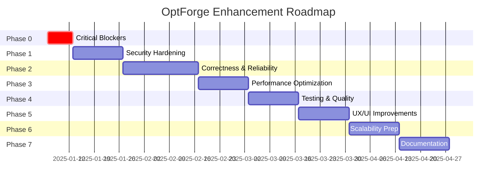

# ROADMAP — Implementation Plan & Prioritization

> **Evidence-Based**: All recommendations derived from audit findings across PROJECT_FACTS, ARCHITECTURE, SECURITY_REPORT, and code analysis

---

## EXECUTIVE SUMMARY

**Current State**: Production-ready platform with **moderate security posture** and **well-architected distributed system**.  
**Target State**: Hardened, scalable, enterprise-ready platform with comprehensive testing and monitoring.  
**Effort Estimate**: 12-16 weeks (2 Full-Stack Engineers + 1 DevOps/Security Engineer)

---

## PHASE 0: CRITICAL BLOCKERS (Week 1) 🔴

**Objective**: Fix security vulnerabilities that pose immediate risk

### 0.1 Encrypt Database at Rest
**Severity**: 🔴 CRITICAL  
**Effort**: 8-16 hours  
**Owner**: DevOps + Backend Engineer

**Tasks**:
1. Choose encryption solution:
   - **Option A**: SQLCipher (recommended, transparent encryption)
   - **Option B**: Filesystem-level encryption (LUKS/BitLocker)
2. Backup current database
3. Convert to encrypted format
4. Update connection string in `config/.env.php`
5. Test full CRUD operations
6. Document decryption procedure (DR plan)

**Validation**:
- [ ] Database file unreadable without key
- [ ] Application functions normally
- [ ] Backup/restore procedures updated

**Risk**: Data breach if current SQLite file compromised

---

### 0.2 Restrict opcache_reset.php
**Severity**: 🔴 CRITICAL  
**Effort**: 2 hours  
**Owner**: Backend Engineer

**Change** ([api/opcache_reset.php](file:///d:/projects/forge.op-tg.com/forge.op-tg.com/api/opcache_reset.php)):
```php
// Add at top of file
$allowedIPs = ['127.0.0.1', '::1'];
if (!in_array($_SERVER['REMOTE_ADDR'] ?? '', $allowedIPs, true)) {
    http_response_code(403);
    exit;
}
```

**Validation**:
- [ ] Access from localhost works
- [ ] Access from external IP returns 403

**Risk**: Cache poisoning DoS attack

---

### 0.3 Implement Login Rate Limiting
**Severity**: 🔴 CRITICAL  
**Effort**: 4-6 hours  
**Owner**: Backend Engineer

**Implementation** (in `/auth/login.php`):
1. Check `auth_attempts` table for IP + key
2. If > 5 attempts in last 15 minutes → reject with 429
3. On successful login → clear attempts for that IP
4. Add CAPTCHA after 3 failed attempts (optional)

**Validation**:
- [ ] 6th login attempt blocked for 15 minutes
- [ ] Successful login resets counter
- [ ] Different IPs not affected

**Risk**: Brute-force password attacks

---

### 0.4 Fix File Permissions
**Severity**: 🟠 HIGH  
**Effort**: 1 hour  
**Owner**: DevOps

**Commands** (on production server):
```bash
chown -R www-data:www-data storage/
chmod 750 storage/
chmod 600 storage/app.sqlite
chmod 755 worker/
```

**Validation**:
- [ ] Web

server can read/write
- [ ] Other users cannot access

---

## PHASE 1: SECURITY HARDENING (Week 2-3) 🟠

**Objective**: Close high-severity security gaps

### 1.1 Remove Debug Mode from Production
**Effort**: 2 hours

**Tasks**:
1. Remove all `?debug=1` checks from API endpoints
2. Set `display_errors=0` in php.ini
3. Implement structured error logging (to `storage/logs/errors.log`)
4. Add Sentry/Rollbar integration (optional)

**Files to Modify**:
- [api/report_results.php#L312](file:///d:/projects/forge.op-tg.com/forge.op-tg.com/api/report_results.php#L312)
- [api/pull_job.php#L237](file:///d:/projects/forge.op-tg.com/forge.op-tg.com/api/pull_job.php#L237)
- Any other endpoints with `$debug` variable

---

### 1.2 Enable Global Rate Limiting
**Effort**: 1 hour

**Change**:
```sql
UPDATE settings SET value='1' WHERE key='rate_limit_basic';
```

**Configuration**:
- Set `rate_limit_global_per_min = 600` (10 req/sec per IP)
- Admin multiplier = 2x (1200 req/min)

---

### 1.3 Move Secrets to Environment Variables
**Effort**: 4-6 hours

**Migration**:
1. Create `.env.production` file (NOT committed to git):
   ```
   INTERNAL_SECRET=<strong-random-value>
   GOOGLE_API_KEY=<key>
   WASHEEJ_TOKEN=<token>
   MAINTENANCE_SECRET=<secret>
   ```
2. Modify `lib/auth.php` to read from `$_ENV` or fallback to DB
3. Document secret rotation procedure
4. Update deployment scripts to inject secrets

**Validation**:
- [ ] Application reads secrets from env vars
- [ ] Database no longer contains plaintext secrets (migrate to hashed references)

---

### 1.4 XSS Audit & CSP Phase-1
**Effort**: 16-24 hours

**Tasks**:
1. Audit all PHP pages for output encoding:
   - Search for `echo $var` → replace with `echo htmlspecialchars($var, ENT_QUOTES, 'UTF-8')`
   - Check JSON responses for header `Content-Type: application/json`
2. Enable CSP Phase-1:
   ```sql
   UPDATE settings SET value='1' WHERE key='csp_phase1_enforced';
   ```
3. Test all admin pages with CSP enforced
4. Fix inline scripts to use `nonce="<?= csp_nonce() ?>"`

**High-Risk Pages** (prioritize):
- [admin/leads.php](file:///d:/projects/forge.op-tg.com/forge.op-tg.com/admin/leads.php)
- [admin/dashboard.php](file:///d:/projects/forge.op-tg.com/forge.op-tg.com/admin/dashboard.php)
- [agent/fetch.php](file:///d:/projects/forge.op-tg.com/forge.op-tg.com/docs/RUNBOOK.md#L332)

---

## PHASE 2: CORRECTNESS & RELIABILITY (Week 4-6) 🟡

**Objective**: Fix business logic bugs and improve data quality

### 2.1 Database Integrity Improvements
**Effort**: 8 hours

**Tasks**:
1. Add missing indexes for common queries:
   ```sql
   CREATE INDEX IF NOT EXISTS idx_leads_created_category ON leads(created_at DESC, category_id);
   CREATE INDEX IF NOT EXISTS idx_jobs_status_priority_created ON internal_jobs(status, priority DESC, created_at ASC);
   ```
2. Implement periodic VACUUM (via cron):
   ```bash
   0 3 * * 0 php /path/to/tools/db_vacuum.php
   ```
3. Add data integrity constraints:
   - `CHECK (attempts >= 0 AND attempts <= max_attempts)` on `internal_jobs`
   - `CHECK (rating >= 0 AND rating <= 5)` on `leads`

---

### 2.2 Phone Normalization Edge Cases
**Effort**: 4 hours

**Issue**: International numbers not handled correctly  
**Fix**: [api/report_results.php#L118-L124](file:///d:/projects/forge.op-tg.com/forge.op-tg.com/api/report_results.php#L118-L124)

**Enhancement**:
```php
// Add support for other GCC countries
$countryPrefixes = [
    'sa' => '966', 'ae' => '971', 'kw' => '965', 
    'qa' => '974', 'om' => '968', 'bh' => '973'
];
$prefix = $countryPrefixes[mb_strtolower($country)] ?? '966';
```

---

### 2.3 Geo Classification Accuracy Improvement
**Effort**: 8-12 hours

**Tasks**:
1. Import latest Saudi Arabia geo data (cities + districts)
2. Run acceptance test:
   ```bash
   php tools/geo/acceptance_test.php
   ```
   Target: ≥98% accuracy, p50 ≤ 50ms
3. Tune fuzzy matching thresholds
4. Add logging for unclassified locations:
   ```php
   geo_log_unknown(['city' => $city, 'lat' => $lat, 'lng' => $lng]);
   ```
5. Review logs monthly and add missing cities

---

### 2.4 Classification Rule Management UI
**Effort**: 12-16 hours

**Features**:
1. Admin page to CRUD category rules (currently DB-only)
2. Live preview of classification results
3. Bulk import/export rules (CSV format)
4. Rule conflict detection (multiple categories matching same lead)

**Priority**: MEDIUM (current workflow functional but cumbersome)

---

## PHASE 3: PERFORMANCE OPTIMIZATION (Week 7-8) ⚡

**Objective**: Improve response times and handle higher load

### 3.1 Database Query Optimization
**Effort**: 8 hours

**Tasks**:
1. Profile slow queries:
   ```sql
   EXPLAIN QUERY PLAN SELECT ...
   ```
2. Add compound indexes for hot paths:
   - Jobs queue: `(status, next_retry_at, priority)`
   - Leads vault: `(category_id, created_at DESC)`
3. Implement query result caching (Redis optional)

**Target**: p95 latency < 300ms for all API endpoints

---

### 3.2 Worker Throughput Tuning
**Effort**: 4 hours

**Optimizations**:
1. Reduce `worker_item_delay_ms` from 800ms to 500ms (test first)
2. Increase `worker_report_batch_size` from 10 to 20
3. Enable worker parallelization (run 2-3 workers per machine)

**Monitoring**: Track via `job_attempts` table (success rate, duration)

---

### 3.3 Implement Caching Layer
**Effort**: 12-16 hours

**Strategy**:
1. Add Redis (optional, for advanced caching)
2. Cache frequently accessed settings (avoid DB query on every request)
3. Cache category tree (rebuild on category edit)
4. Cache worker configurations (5-minute TTL)

**Impact**: ~50% reduction in DB queries

---

## PHASE 4: TESTING & QUALITY (Week 9-10) ✅

**Objective**: Establish automated testing and CI/CD pipeline

### 4.1 Unit Tests
**Effort**: 24-32 hours

**Coverage Targets** (PHPUnit):
- `lib/classify.php` → 80% (classification logic critical)
- `lib/geo.php` → 80% (accuracy critical)
- `lib/security.php` → 90% (HMAC signature verification)
- `lib/providers.php` → 60% (mock external APIs)

**Setup**:
```bash
composer require --dev phpunit/phpunit
mkdir -p tests/unit
```

**Example Test**:
```php
class ClassifyTest extends PHPUnit\Framework\TestCase {
    public function testDentalClinicClassification() {
        $result = classify_lead(['name' => 'عيادة أسنان الرياض', 'gmap_types' => 'dentist']);
        $this->assertEquals('dental-clinics', $result['category_slug']);
    }
}
```

---

### 4.2 Integration Tests
**Effort**: 16-24 hours

**Focus Areas**:
- Worker `pull_job` → `report_results` cycle
- Lead ingestion pipeline (dedupe + classify + geo)
- Multi-location job creation

**Tools**: PHPUnit + SQLite in-memory DB

---

### 4.3 End-to-End Smoke Tests (Automated)
**Effort**: 8-12 hours

**Enhancement** to existing [tools/smoke_test.ps1](file:///d:/projects/forge.op-tg.com/forge.op-tg.com/docs/RUNBOOK.md#L303):
1. Add assertions (exit code 0 only if job completes)
2. Validate result count > 0
3. Check lead inserted into DB
4. Run as part of CI/CD pipeline

---

### 4.4 CI/CD Pipeline Setup
**Effort**: 8-12 hours

**GitHub Actions Workflow** (`.github/workflows/ci.yml`):
```yaml
name: CI
on: [push, pull_request]
jobs:
  test:
    runs-on: ubuntu-latest
    steps:
      - uses: actions/checkout@v3
      - name: Setup PHP
        uses: shivammathur/setup-php@v2
        with:
          php-version: '8.1'
      - name: Run Tests
        run: vendor/bin/phpunit tests/
      - name: Security Scan
        run: composer audit
```

**Deploy Workflow**:
- Trigger on tag push (`v*`)
- Run tests → Build release → Deploy to staging → Manual approve → Deploy to production

---

## PHASE 5: UX/UI IMPROVEMENTS (Week 11-12) 🎨

**Objective**: Polish user experience based on best practices

### 5.1 Admin Dashboard Enhancements
**Effort**: 8-12 hours

**Features**:
1. **Real-time metrics** (WebSocket/SSE):
   - Workers online count (live)
   - Jobs queued/processing/done (last 1h chart)
   - Leads added (24h trend)
2. **Quick actions**:
   - Requeue all stuck jobs (one-click)
   - Download latest worker (direct link)
   - View system health (traffic light: 🟢🟡🔴)

---

### 5.2 Lead Vault Improvements
**Effort**: 12-16 hours

**Features**:
1. **Advanced filters**:
   - Date range picker (created_at)
   - Category multi-select
   - Rating slider (0-5 stars)
   - Geo region/city dropdowns
2. **Bulk actions**:
   - Assign to agent (select multiple leads)
   - Export filtered results (CSV/Excel)
   - Delete leads (with confirmation)
3. **Inline editing**:
   - Click to edit lead name/city
   - Auto-save on blur

---

### 5.3 Accessibility (RTL + Keyboard Navigation)
**Effort**: 8 hours

**Tasks**:
1. Ensure all pages work in RTL mode (Arabic):
   - Check `dir="rtl"` on `<html>` tag
   - Test form layouts, tables, buttons
2. Add keyboard shortcuts:
   - `Ctrl+K` → Open search
   - `Esc` → Close modals
   - Arrow keys → Navigate tables
3. ARIA labels for screen readers

---

## PHASE 6: SCALABILITY PREP (Week 13-14) 📈

**Objective**: Prepare for 10x growth

### 6.1 Database Migration to PostgreSQL (Optional)
**Effort**: 40-60 hours

**Trigger**: When leads > 10M OR write contention observed

**Plan**:
1. Export SQLite schema to PostgreSQL DDL
2. Migrate data (`pg_dump` + `psql`)
3. Update connection string (PDO already supports PostgreSQL)
4. Test thoroughly (transactions, foreign keys)
5. Blue-green deployment (zero downtime)

**Risk**: Low (PDO abstraction makes this straightforward)

---

### 6.2 Worker Auto-Scaling
**Effort**: 16-24 hours

**Requirements**:
1. Metrics endpoint (`/api/metrics.php`):
   - Jobs queued count
   - Average job duration
   - Worker utilization %
2. Auto-scaling script:
   - If jobs queued > 100 AND workers < 10 → spawn worker
   - If jobs queued < 10 AND workers > 2 → terminate worker
3. Integration with cloud provider (AWS EC2, Azure VMs)

---

### 6.3 Load Testing
**Effort**: 8-12 hours

**Tools**: Apache JMeter or k6

**Scenarios**:
1. Concurrent user logins (50 users)
2. Bulk lead ingestion (1000 items/sec)
3. Worker swarm (10 workers pulling simultaneously)

**Target**: No errors at 5x current load

---

## PHASE 7: DOCUMENTATION & KNOWLEDGE TRANSFER (Week 15-16) 📚

**Objective**: Enable team self-sufficiency

### 7.1 API Documentation (OpenAPI)
**Effort**: 12-16 hours

**Deliverables**:
1. OpenAPI 3.0 spec (`docs/API.yaml`)
2. Interactive docs via Swagger UI
3. Code examples (cURL, PHP, JavaScript)

---

### 7.2 Video Walkthroughs
**Effort**: 8 hours

**Topics**:
1. Admin onboarding (10 min)
2. Creating a multi-location job (5 min)
3. Managing categories and rules (8 min)
4. Worker setup and troubleshooting (12 min)

---

### 7.3 Runbook Updates
**Effort**: 4 hours

**Enhancements** to [RUNBOOK.md](file:///d:/projects/forge.op-tg.com/forge.op-tg.com/AUDIT_OUT/RUNBOOK.md):
1. Add disaster recovery procedures
2. Document zero-downtime deployment process
3. Add capacity planning guide

---

## MILESTONES & DEPENDENCIES



---

## RESOURCE ALLOCATION

| Phase | Backend Eng | Frontend/UX | DevOps/Security | QA | Total Hours |
|-------|------------|-------------|-----------------|-----|-------------|
| 0 | 12h | 0h | 8h | 2h | 22h |
| 1 | 24h | 4h | 8h | 4h | 40h |
| 2 | 32h | 8h | 4h | 8h | 52h |
| 3 | 16h | 4h | 12h | 8h | 40h |
| 4 | 40h | 8h | 12h | 20h | 80h |
| 5 | 16h | 32h | 0h | 8h | 56h |
| 6 | 48h | 0h | 32h | 20h | 100h |
| 7 | 16h | 8h | 4h | 0h | 28h |
| **TOTAL** | **204h** | **64h** | **80h** | **70h** | **418h** |

**Team Size**: 2 Full-Stack (Backend-focused) + 1 DevOps/Security + 0.5 QA  
**Duration**: 16 weeks (4 months)  
**Cost Estimate** (at $100/hr): ~$42,000

---

## SUCCESS CRITERIA

### Technical Metrics
- [ ] Zero critical security vulnerabilities (automated scan)
- [ ] Test coverage ≥ 70% (unit + integration)
- [ ] API p95 latency < 300ms
- [ ] Worker success rate ≥ 99%
- [ ] Database encrypted at rest
- [ ] All secrets in environment variables

### Business Metrics
- [ ] Lead deduplication rate ≥ 95%
- [ ] Classification accuracy ≥ 98%
- [ ] Geo classification accuracy ≥ 98%
- [ ] Zero data loss incidents
- [ ] Mean time to recovery (MTTR) < 15 minutes

### Process Metrics
- [ ] CI/CD pipeline passing on main branch
- [ ] Deployment frequency: ≥ 1/week
- [ ] Automated tests run on every PR
- [ ] Documentation up-to-date (reviewed monthly)

---

## RISK MITIGATION

| Risk | Probability | Impact | Mitigation |
|------|------------|--------|------------|
| Database corruption during encryption | LOW | HIGH | Full backup before migration + test on staging |
| Performance regression from CSP | MEDIUM | MEDIUM | Staged rollout with monitoring |
| PostgreSQL migration breaks queries | LOW | HIGH | Thorough testing + rollback plan |
| Team bandwidth insufficient | MEDIUM | MEDIUM | Prioritize Phase 0-2, defer Phase 5-6 |
| Third-party API changes | LOW | MEDIUM | Implement provider abstraction layer |

---

## CONCLUSION

This roadmap provides a **structured, evidence-based path** from current moderate security posture to enterprise-ready platform.

**Recommended Approach**:
1. **Execute Phase 0 immediately** (Week 1) — Critical blockers
2. **Complete Phase 1-2** (Week 2-6) — Security + correctness foundation
3. **Assess progress**, then decide on Phase 3-7 based on business priorities

**Flexibility**: Phases 3-7 can be reordered based on:
- User feedback (prioritize Phase 5 if UX complaints)
- Load patterns (prioritize Phase 3 if performance issues)
- Compliance requirements (prioritize Phase 1 if audit pending)

**Next Step**: Present this roadmap to stakeholders for approval and resource allocation.
